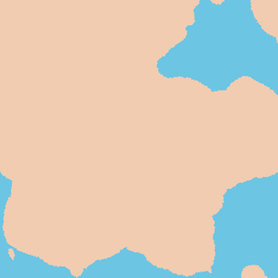
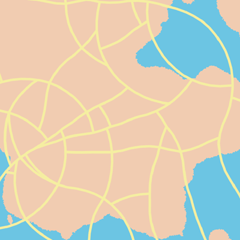

# Haoran Wei (82926501)

## Demo
- [Demo Page]()

## Techniques
### Terrain and Population Density Map
 - Use FBM Worley noise to generate the height map and use a threshold (i.e. sea level) to control the percentage for land and sea. Blue is sea and yellow is land.
 - Use a small size Worley noise to pixelate the map.
 - Use a Worley noise to generate the population density map based on the interpolation between shortest and secondary distance. Red is high and blue is low.

Terrain, Population Density Map and Overlaid Map

   

### Highway Generation
- Generate highway structure from a random point on the ground.
- Use a pseudo L-System code to generate the highway struture. Highway extends towards the direction where there is a steeper gradient of population density.
- Check intersection during extension.
- Prevent highway from branching in sea.

Highway and highway over Population Density Map

 

### Street Generation
- Generate street structure from a random point in a cell of highway.
- Similar to highway generation but never turns to a hotspot of population density map. Randomly check and select a direction where the span of the highway cell is about the longest.
- Also check intersection with highway structure and all streets. Abandon a street structure if it stops extension (i.e. has intersected with other roads) within 4 steps.